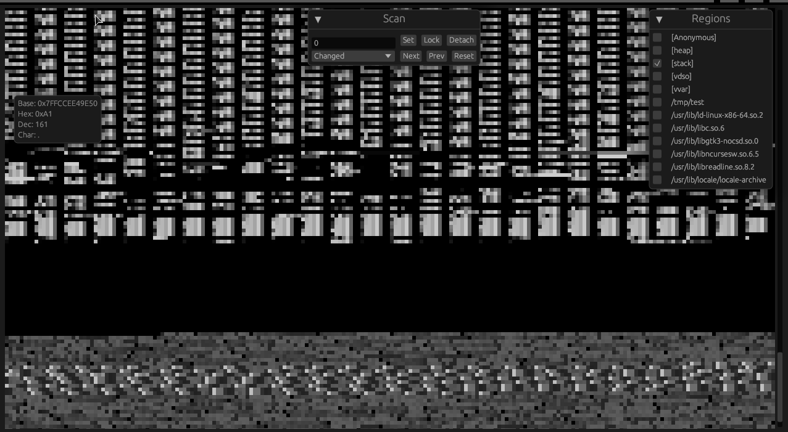

# smem

**smem** is a memory scanning and visualization tool written in Rust, utilizing the `eframe` and `egui` crates for a modern graphical user interface. With **smem**, users can attach to processes, scan memory regions, and visualize or modify memory values in real-time.

## Features

**Memory Operations:**
- **Attach/Detach**: Interface with process memory via `/proc/<pid>/mem`.
- **Read/Write**: Modify and access memory regions directly.
- **Visualization**: Dynamically display memory regions.

**Scanning Functions:**
- **Exact Match**: Search for exact numerical matches.
- **Value Changes**: Track modifications in memory values.
- **Trends**: Detect trends such as value increases or decreases.
- **Continuous Monitoring**: Automatically update monitored values.

**User Interface and Controls:**
- **Clipboard Interaction**: Right-click to copy a memory address.
- **Functional Keys**:
  - **F1**: Connect to a process by its ID.
  - **F2**: Commence a memory scan.
  - **F3**: Access previous scan results.
  - **F4**: Reset scanning configurations.
  - **F5**: Target a specific memory address for operations.
  - **F7**: Lock onto a memory address for ongoing updates.
  - **F8-F10**: Activate scans for changes, increases, or decreases.
  - **F11/F12**: Scale the visualization size up or down.

**Input Value:**
- **`b<value>`**: Parses the value as a byte.
- **`0x<hex_value>`**: Interprets the value as a hexadecimal number.
- **`d<decimal_value>`**: Treats the value as a double.
- **`<value>`**: Assumes the value is an integer or float.

## Requirements

- **Rust** (1.70 or later recommended)
- Linux (requires `/proc` filesystem support)
- Root permissions (to access process memory)

## Installation

Clone the repository and run the application directly:

```bash
git clone https://github.com/x3ric/smem.git
cd smem
sudo cargo run -- "$(pidof test | awk '{print $1}')"
```


